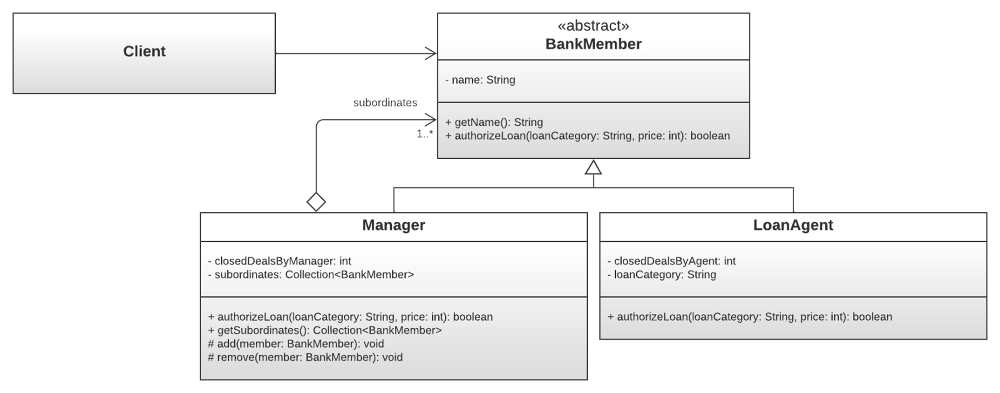
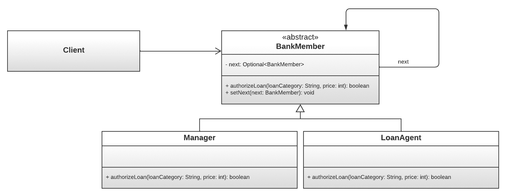

## Overview
This project aims to develop a software prototype in Java that models a bank loan management system. The goal is to create a robust and efficient system for managing various aspects of bank loans. The development process will adhere to the best practices of <i>object-oriented programming, SOLID principles</i>, and the application of <i>design patterns</i>.

The project begins with requirement analysis to identify the key functionalities of the system. This is followed by the design phase, where a structured model using classes and objects is created. Principles and patterns are applied to ensure the design is modular and maintainable. Finally, the prototype is implemented in Java, ensuring it meets the defined requirements and functions correctly.

This project provides a practical and concrete experience in modeling and programming complex software systems, preparing developers for future challenges in software development.

## Project Description
The objective of this project is to implement a bank loan management system, specifically modeling the entities involved in loan management. The entities, in this case, are agents and their managers, structured in a tree hierarchy. Each entity can authorize a loan based on the following criteria:

 - Agents can authorize loans up to 10,000 depending on their assigned category.
 - Managers can authorize loans from 10,001 to 200,000, regardless of the loan category.

Additionally, the system will generate reports to calculate the salaries of each staff member and the loans they have authorized.

## Design Choices
### Composite Pattern
To model the hierarchical structure of entities, the Composite pattern is used, allowing for uniform treatment of whole objects and their components. The chosen variant is "Design for Type Safety," ensuring that operations on children (add, remove, etc.) are only performed by composite classes (Manager) and not by the abstract class (BankMember), preventing leaf classes (LoanAgent) from implementing these methods.

 - Component: "BankMember" is an abstract class that defines common behavior for its subclasses.

 - Composite: "Manager" is the composite class that performs default operations and manages child components (subordinates) with methods like getSubordinate, add, and remove.

 - Leaf: "LoanAgent" is the leaf class representing the end nodes of the tree structure and performs the default operation.

### Chain of Responsibility Pattern
For the loan authorization operation (authorizeLoan), the Chain of Responsibility pattern is used. This behavioral pattern decouples the sender of a request from its receiver. The client requests the abstract class BankMember, which handles who performs the operation among objects (between Manager and LoanAgent) in the chain. During the authorizeLoan method execution, BankMember calls the next element in the chain via the next field, which tries to perform the operation, and so on until the operation is completed or there are no more elements in the chain.

### Builder Pattern
To create entities, particularly Manager and LoanAgent, the Builder pattern is used. This allows for object construction using a helper class instead of traditional constructors, improving both safety during the construction process and code readability. Constructors are made private to prevent direct instantiation.

 - Builder Classes: ManagerBuilder and LoanAgentBuilder store the fields required to create objects. They validate fields and create the object using the build method.

 - Builders ensure that the next field is always managed, either with a BankMember object or null.

### Static Factory Method
Along with the Builder pattern, the Static Factory Method pattern is used to avoid constructors. This results in cleaner and more readable code. Instead of calling the constructor of the main class (Manager and LoanAgent) and the helper class constructors (ManagerBuilder and LoanAgentBuilder), a static builder method is used to create objects.

### Visitor Pattern
To add new operations (e.g., generating reports on salaries and authorized loans) to existing object structures without modifying them, the Visitor pattern is used. This behavioral pattern allows new operations to be added by extending the code rather than modifying it, adhering to the "Open/Closed Principle." The generic version of the Visitor pattern is used, allowing flexibility in the return type, enabling a single interface for all possible return types instead of creating a new interface for each required return type.

## Testing Strategies
For testing concrete classes, the "AssertJ" library is used due to its fluent interface, which is easier to understand and use compared to standard JUnit methods.

 - Manager and LoanAgent Classes: Tested by verifying if methods return the expected results.
 - Builder Classes: Tested by verifying object instantiation with all required and optional fields, and handling parameter errors by capturing exceptions.
 - Chain of Responsibility Pattern: Tested using separate test files to cover all possible scenarios.
 - Visitor Pattern: Mock classes are used to test implementations of the Printer interface, and all possible scenarios are tested by comparing expected values with results. 
 - IDE-generated methods are not tested.

## UML Diagram

## Documentation & Repository
You can download the complete documentation <a href="documentation.pdf">here</a>, including detailed analysis. The repository is available <a href="https://github.com/ngljcb/project_16566_metodologie">here</a> for browsing all the project resources.